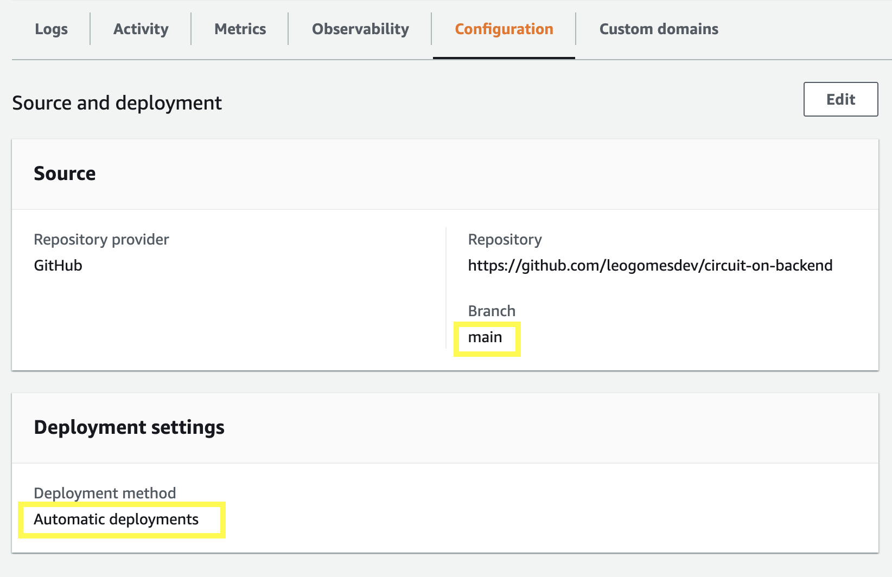

# 🌐 CIRCUIT ON (Backend)

## ☁ Using AWS App Runner

1. Login into your AWS Account and setup the new application
2. Follow the simple steps provided by the wizard on the screen
3. You can config as **automatic deployment**, then when a pull request is approved, it automatically triggers a new deployment for the latest code version

   

4. Set the **Build Settings** as below:

- Build command:

  ```bash
    npm install && npm run build
  ```

- Start command:

  ```bash
    npm run start:prod
  ```

- Port:

  ```bash
    3000
  ```

At the **Service Settings** section **Environment Variables**, add each variable as mentioned on file [.env.example](.env.example)

### 📝 Docs and external resources:

- [Docs: Deploying a new application version to App Runner](https://docs.aws.amazon.com/apprunner/latest/dg/manage-deploy.html)
