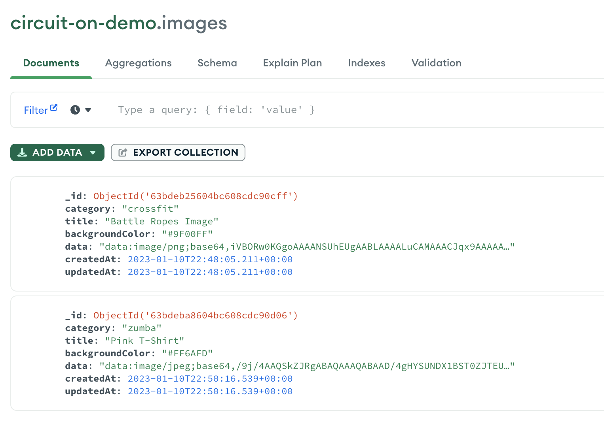
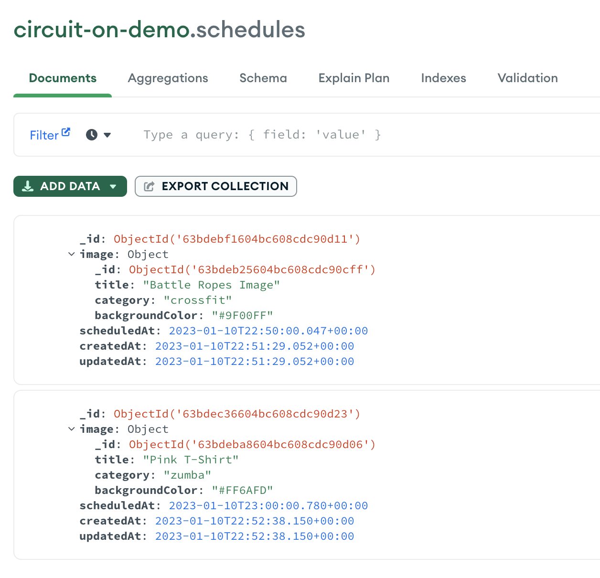

# 🌐 CIRCUIT ON

## 📇 MongoDB Structure

This project would create the following collections on the MongoDB Database:

1. Images collection:
   
2. Schedules collection:
   

## 🗂 MongoDB Indexes

After creating the first documents on the collections, additional Indexes can support faster queries.

- Add the following index to support the aggregation pipeline getGroupedByCategory at src/api-modules/images/images.service.ts:
  ```javascript
  db.images.createIndex({ category: 1, updatedAt: -1 });
  ```

### 📝 Docs and external resources:

- [Docs: Indexes - MongoDB Manual](https://www.mongodb.com/docs/manual/indexes/)
