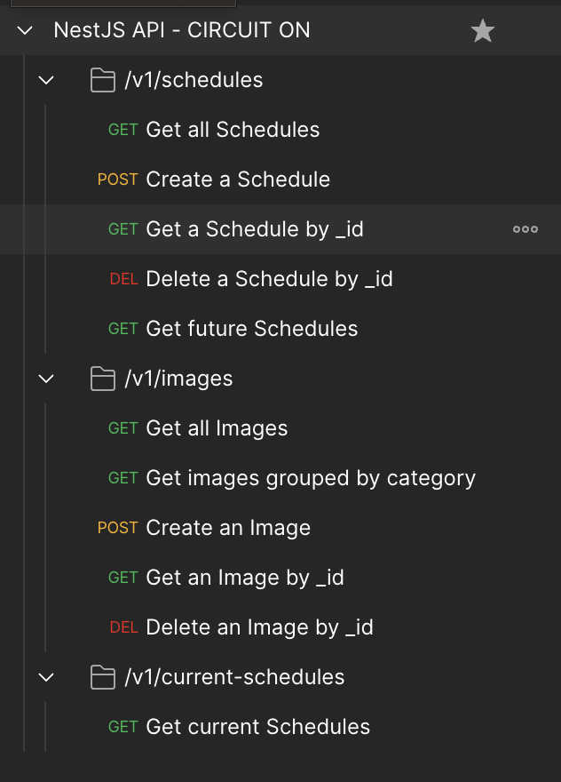
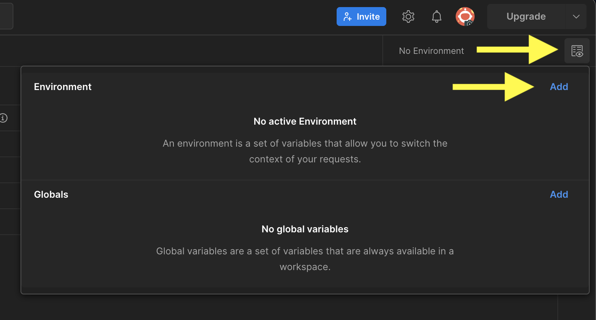
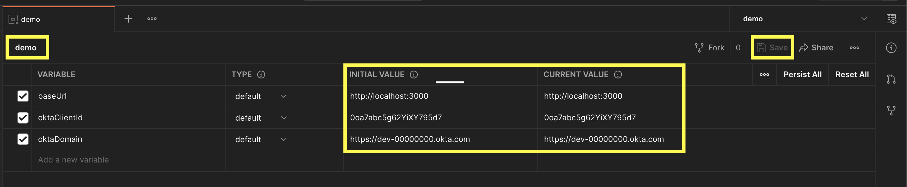
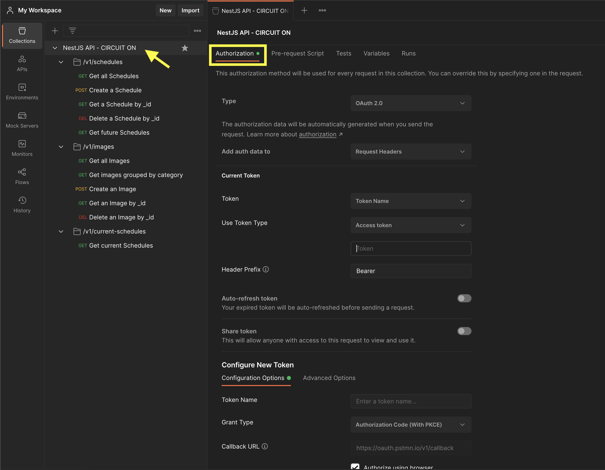
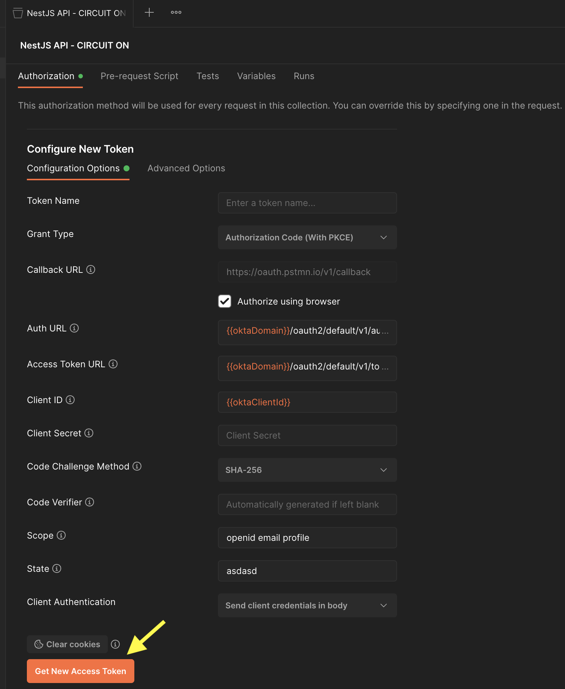
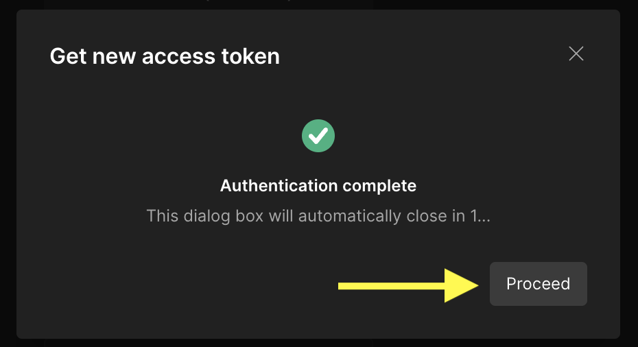
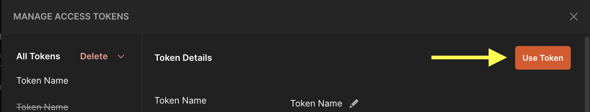

# 🌐 CIRCUIT ON

## 📚 Using Postman for API calls

1. Using [Postman](https://www.postman.com), go to the menu **Files > Import** and import the file **NestJS API - CIRCUIT ON.postman_collection.json**, available on this folder
   - After importing, you should be able to see the **API Collection on the left**:
     
2. On the top right, click on the **environment button**, click on **Add** and include on the list the required environments. Enter the values and **Save**.
   - baseUrl => Your App URL, e.g.: http://localhost:3000
   - oktaClientId => Your OKTA Client Id, e.g.: 0oa7abc5g62YiXY795d7
   - oktaDomain => Your OKTA Domain, e.g.: https://dev-00000000.okta.com
     
     
3. On the left, double-click on **NestJS API - CIRCUIT ON** and go to the **Authorization** tab
   
4. At the end of the Authorization tab, click on **Get New Access Token**
   
5. The browser will automatically open. Login using your credentials
6. Click on **Proceed**
   
7. Click on **Use Token**
   
8. Now you can use the API requests

### 📝 Docs and external resources:

- [Docs: Managing environments | Postman Learning Center](https://learning.postman.com/sending-requests/managing-environments)
- [Docs: Implement OAuth for Okta](https://d28m3l9ryqsunl.cloudfront.net/guides/implement-oauth-for-okta/main/)
